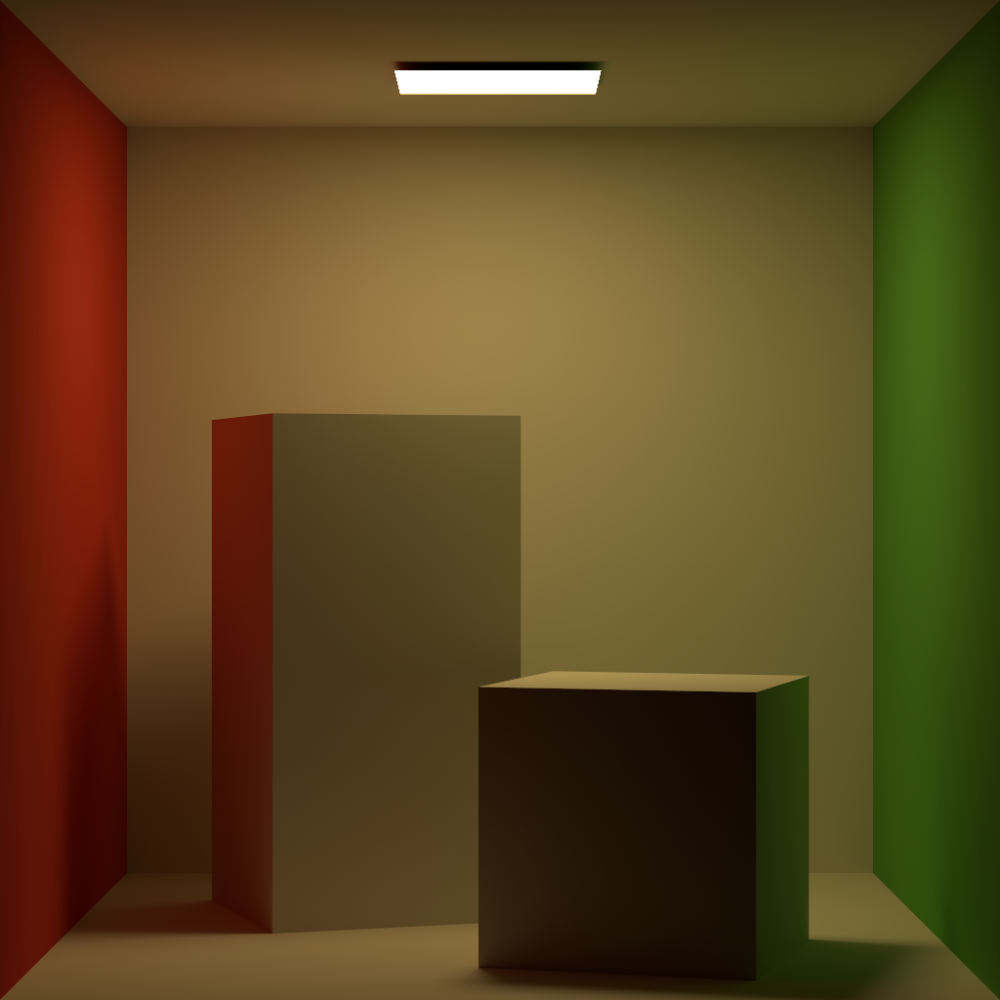

# The Dakku Renderer

## About

**Dakku** is a **physically based** renderer for the purpose of learning global illumination and ray tracing.   
Dakku is written in **modern C++** (>= 20) and integrates [embree](https://github.com/embree/embree) for high performance computing.   
The project structure is similar to [pbrt-v3](https://github.com/mmp/pbrt-v3) but the implementation is very different.

**Note: This project is still under development. It may change a lot in the future.**

## Build

We recommend you to use [vcpkg] to install prerequisite libraries.  
We use vcpkg [manifest mode](https://github.com/microsoft/vcpkg/blob/master/docs/specifications/manifests.md) for dependency management.  
You can take a look at [vcpkg.json](vcpkg.json) if you want to install dependency on your own without vcpkg.

Then use [CMake](https://cmake.org/) to build the project.

## Scenes

## Finished features

### Integrators

- Path tracing

### Materials

- BSDFS
  - Lambertian diffuse

### Accleration Structures

- [Embree](https://github.com/embree/embree)

### Lights

- Diffuse area light

### Samplers

- Random sampler

### Cameras

- Perspective camera

## TODO Lists

- Texture
- File loaders
- More materials
- More integrators
- More samplers
- More camera models
- BSSRDF
- MIS
- Volume rendering
- Denoiser
- GUI
- Self-made math library
- GPU (OptiX)
