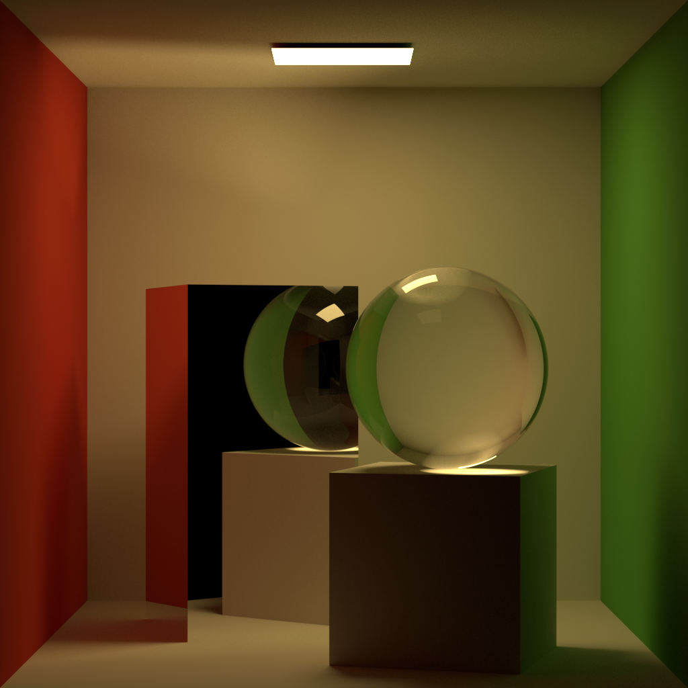
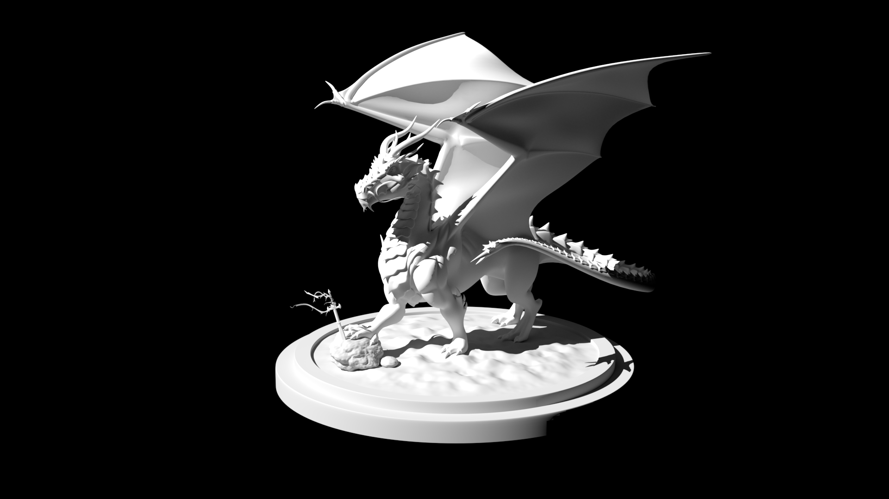
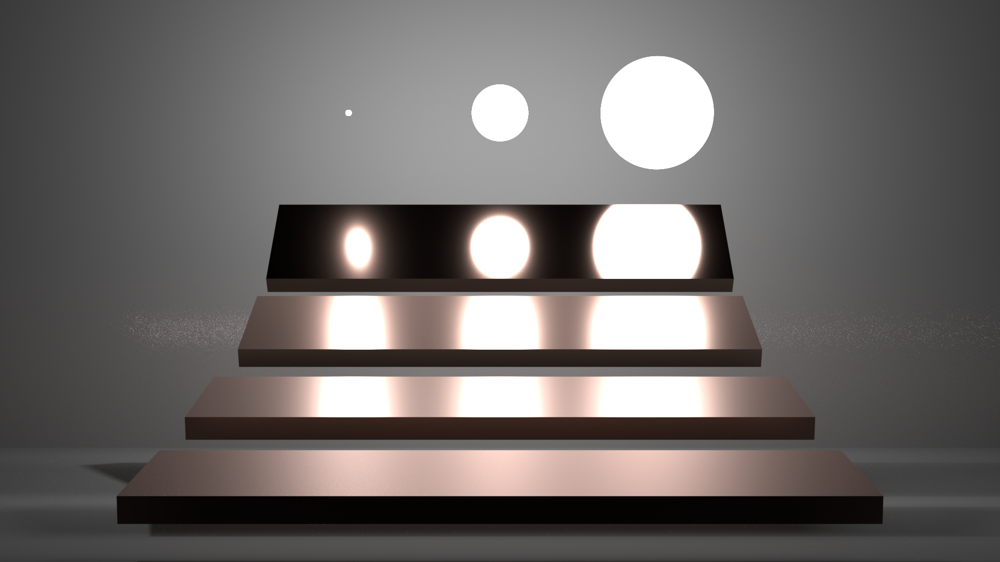

# The Dakku Renderer

**Warning: This project is currently under developing and does not guarantee any consistency.**

## About

**Dakku** is a **physically based** renderer for the purpose of learning global illumination and ray tracing.   
Dakku is written in **modern C++** (>= 20) and integrates [embree](https://github.com/embree/embree) for high performance computing.   
The project structure is similar to [pbrt-v3](https://github.com/mmp/pbrt-v3) but the implementation is very different.

## Build

You are recommended to use [vcpkg](https://github.com/microsoft/vcpkg) with [manifest mode](https://github.com/microsoft/vcpkg/blob/master/docs/specifications/manifests.md) to install prerequisite libraries.  
You can take a look at [vcpkg.json](vcpkg.json) if you want to install dependency on your own without vcpkg.

Then use [CMake](https://cmake.org/) to build the project.

## Scenes

[Cornell Box](scenes/cornell_box/scene.json)

[Cornell Box Specular](scenes/cornell_box/scene_specular.json)

[Dragon](scenes/dragon/scene.json)

[Veach, MIS](scenes/veach-mis/scene.json)

### Description

The scene description schema can be found in [schema.json](scenes/schema.json).  
